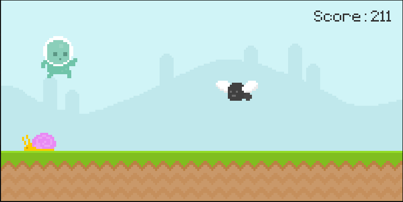

# Runner

A simple game built with PyGame.

## Gameplay



Press **SPACE** to jump, **r** to play again.

## Usage

> Clone the repository

```bash
git clone https://github.com/ednoram/runner-game.git
```

> Install the required packages

```bash
pip install -r requirements.txt

```

> Run main.py

```bash
python3 ./main.py

```

## Contact

Edward Noramirian

> GitHub: [@ednoram](https://github.com/ednoram)

> LinkedIn: [Edward Noramirian](https://www.linkedin.com/in/edward-noramirian)

> Email: e.noramirian@gmail.com
